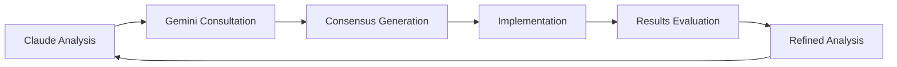

# 🤝 Guide Pratique - Consultation Gemini CLI

## 🎯 Objectif

Obtenir un **consensus technique** entre Claude et Gemini pour maximiser les chances de succès du projet d'autonomie DOFUS complète.

---

## 📋 Prérequis

### 1. Installation Gemini CLI

```bash
# Option 1: Via pip
pip install google-generativeai

# Option 2: Via npm (si vous préférez)
npm install -g @google/generative-ai

# Vérification installation
gemini --version
```

### 2. Configuration API Key

```bash
# Définir votre clé API Google AI
export GOOGLE_API_KEY="votre_cle_api_ici"

# Ou ajout permanent dans votre .bashrc/.zshrc
echo 'export GOOGLE_API_KEY="votre_cle_api_ici"' >> ~/.bashrc
```

💡 **Obtenir une clé API** : https://ai.google.dev/

---

## 🚀 Utilisation du Script de Consultation

### Lancement Rapide

```bash
# Depuis le dossier du projet
cd G:\Botting

# Consultation sur l'architecture autonome
python scripts/gemini_consensus.py autonomy_architecture

# Consultation sur l'apprentissage automatique
python scripts/gemini_consensus.py learning_intelligence

# Consultation sur la gestion des connaissances
python scripts/gemini_consensus.py knowledge_management

# Consultation sur la simulation comportementale
python scripts/gemini_consensus.py behavioral_simulation
```

### Mode Non-Interactif

```bash
# Génère juste le prompt sans interaction
python scripts/gemini_consensus.py autonomy_architecture --non-interactive

# Lister les consultations précédentes
python scripts/gemini_consensus.py autonomy_architecture --list
```

---

## 📝 Processus de Consultation Étape par Étape

### Étape 1 : Préparation

```bash
python scripts/gemini_consensus.py autonomy_architecture
```

Le script va :
- ✅ Analyser votre architecture actuelle
- ✅ Identifier les points d'amélioration
- ✅ Générer un prompt structuré pour Gemini
- ✅ Sauvegarder la consultation dans `docs/gemini_consultations/`

### Étape 2 : Copie du Prompt

Le script affiche :
```
📋 Consultation préparée: consultation_autonomy_architecture_20250927_143022.json

============================================================
PROMPT POUR GEMINI CLI:
============================================================
# Consultation Technique - Autonomy Architecture

## Contexte Projet
Bot DOFUS autonome avec vision hybride YOLO + Template Matching.
[... prompt complet ...]
============================================================

▶️  Copiez le prompt ci-dessus dans Gemini CLI, puis appuyez sur Entrée...
```

### Étape 3 : Interaction avec Gemini

```bash
# Dans un autre terminal, lancez Gemini CLI
gemini

# Collez le prompt généré et attendez la réponse
```

### Étape 4 : Récupération de la Réponse

Revenez au script qui attend :
```
📝 Collez la réponse de Gemini ci-dessous (terminez par une ligne vide):
```

Copiez la réponse complète de Gemini et terminez par une ligne vide.

### Étape 5 : Génération du Consensus

Le script va automatiquement :
- ✅ Sauvegarder la réponse de Gemini
- ✅ Analyser les points de convergence/divergence
- ✅ Générer un rapport de consensus
- ✅ Sauvegarder le tout dans un fichier JSON

---

## 📊 Types de Consultations Disponibles

### 1. `autonomy_architecture`
**Focus** : Architecture logicielle pour autonomie évolutive
**Questions clés** :
- Patterns optimaux pour IA autonome dans MMORPG
- Gestion d'état complexe multi-dimensionnel
- Séparation responsabilités perception/cognition/action

### 2. `learning_intelligence`
**Focus** : Apprentissage automatique et intelligence adaptative
**Questions clés** :
- Reinforcement Learning vs Decision Trees vs Hybrid
- Modélisation incertitude et prise de risque
- Exploration vs exploitation avec contraintes anti-détection

### 3. `knowledge_management`
**Focus** : Représentation et gestion des connaissances
**Questions clés** :
- Architecture base de connaissances évolutive
- Mécanismes mise à jour automatique
- Fusion connaissances statiques vs dynamiques

### 4. `behavioral_simulation`
**Focus** : Simulation comportement humain réaliste
**Questions clés** :
- Modélisation personnalité évolutive
- Patterns temporels naturels
- Métriques de mesure "humanité"

---

## 📈 Exploitation des Résultats

### Analyse du Fichier de Consultation

```json
{
  "topic": "autonomy_architecture",
  "timestamp": "20250927_143022",
  "claude_analysis": {
    "current_architecture": "...",
    "identified_improvements": "...",
    "technical_challenges": "..."
  },
  "gemini_response": "réponse complète de Gemini...",
  "consensus": {
    "key_agreements": ["point 1", "point 2"],
    "key_differences": ["divergence 1", "divergence 2"],
    "next_actions": ["action 1", "action 2"]
  }
}
```

### Intégration dans le Développement

1. **Points de Consensus** → Implémentation prioritaire
2. **Points de Divergence** → Recherche approfondie ou test A/B
3. **Nouvelles Idées** → Évaluation et intégration dans roadmap
4. **Warnings Techniques** → Révision de l'architecture

---

## 🔄 Workflow Itératif Recommandé

### Cycle de Consultation



### Planning Suggéré

**Semaine 1** : Consultation `autonomy_architecture`
- Validation approche générale
- Identification patterns optimaux
- Consensus sur séparation responsabilités

**Semaine 2** : Consultation `learning_intelligence`
- Choix algorithmes d'apprentissage
- Stratégies d'adaptation
- Gestion de l'incertitude

**Semaine 3** : Consultation `knowledge_management`
- Architecture base de connaissances
- Mécanismes de mise à jour
- Intégration guides externes

**Semaine 4** : Consultation `behavioral_simulation`
- Simulation comportementale avancée
- Patterns de personnalité
- Anti-détection sophistiquée

---

## 🛠️ Dépannage

### Problème : Gemini CLI ne démarre pas
```bash
# Vérification installation
which gemini
pip show google-generativeai

# Réinstallation si nécessaire
pip uninstall google-generativeai
pip install google-generativeai --upgrade
```

### Problème : Erreur d'API Key
```bash
# Vérification variable d'environnement
echo $GOOGLE_API_KEY

# Test de connexion
gemini --help
```

### Problème : Réponse trop longue
- Divisez votre prompt en sections plus petites
- Utilisez le mode non-interactif et consultez Gemini manuellement
- Sauvegardez la réponse par sections

---

## 📚 Ressources Complémentaires

### Documentation Gemini
- [Google AI Documentation](https://ai.google.dev/docs)
- [Gemini API Reference](https://ai.google.dev/api)

### Exemples de Prompts Avancés
- [Prompt Engineering Guide](https://www.promptingguide.ai/)
- [Claude + Gemini Best Practices](docs/prompt_examples/)

### Communauté
- Issues GitHub pour problèmes techniques
- Discord pour discussions temps réel
- Wiki pour documentation collaborative

---

## ✅ Checklist de Consultation Réussie

- [ ] Gemini CLI installé et configuré
- [ ] API Key Google AI configurée
- [ ] Script de consultation fonctionnel
- [ ] Premier prompt testé avec succès
- [ ] Réponse Gemini récupérée et sauvegardée
- [ ] Consensus généré et analysé
- [ ] Actions prioritaires identifiées
- [ ] Intégration dans roadmap de développement

**Prêt pour votre première consultation ? Lancez :**
```bash
python scripts/gemini_consensus.py autonomy_architecture
```

🚀 **Créons ensemble l'IA DOFUS la plus avancée !**